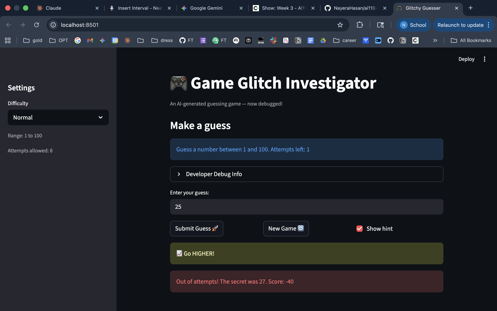

# 🎮 Game Glitch Investigator: The Impossible Guesser

## 🚨 The Situation

You asked an AI to build a simple "Number Guessing Game" using Streamlit.
It wrote the code, ran away, and now the game is unplayable.

- You can't win.
- The hints lie to you.
- The secret number seems to have commitment issues.

## 🛠️ Setup

1. Install dependencies: `pip install -r requirements.txt`
2. Run the app: `python -m streamlit run app.py`

## 🕵️‍♂️ Your Mission

1. **Play the game.** Open the "Developer Debug Info" tab in the app to see the secret number. Try to win.
2. **Find the State Bug.** Why does the secret number change every time you click "Submit"?
3. **Fix the Logic.** The hints ("Higher/Lower") are wrong. Fix them.
4. **Refactor & Test.** Move the logic into `logic_utils.py`. Run `pytest` and keep fixing until all tests pass!

## 📝 Document Your Experience

- [x] **Game purpose:** A number guessing game where the player picks a difficulty, then tries to guess a randomly chosen secret number within a limited number of attempts. Hints guide the player higher or lower after each guess.
- [x] **Bugs found:**
  1. Hints were reversed — "Too High" said "Go HIGHER!" instead of "Go LOWER!"
  2. Secret number was cast to a string on even attempts, breaking comparisons and making wins impossible every other turn.
  3. Hard difficulty had a narrower range (1–50) than Normal (1–100) — should be wider.
  4. Score calculation was inconsistent: wrong guesses randomly added or subtracted points, and wins had an off-by-one error.
  5. UI hardcoded "between 1 and 100" regardless of difficulty.
  6. Attempts started at 1 instead of 0, costing the player one attempt.
  7. New Game button used hardcoded range and didn't reset status/history.
- [x] **Fixes applied:**
  1. Swapped hint messages so "Too High" → "Go LOWER!" and "Too Low" → "Go HIGHER!"
  2. Removed the `str()` cast on even attempts — secret is always compared as an `int`.
  3. Changed Hard range to 1–200.
  4. Simplified scoring: wrong guesses always lose 5 points, wins use `100 - 10 * attempt_number` (no off-by-one).
  5. UI now displays the actual difficulty range dynamically.
  6. Attempts initialize at 0; increment only happens after a valid guess.
  7. New Game resets all session state (secret, attempts, score, status, history) using the correct difficulty range.
  8. Refactored all game logic into `logic_utils.py` and imported it in `app.py`.

## 📸 Demo

## 🚀 Stretch Features

- [ ] [If you choose to complete Challenge 4, insert a screenshot of your Enhanced Game UI here]
